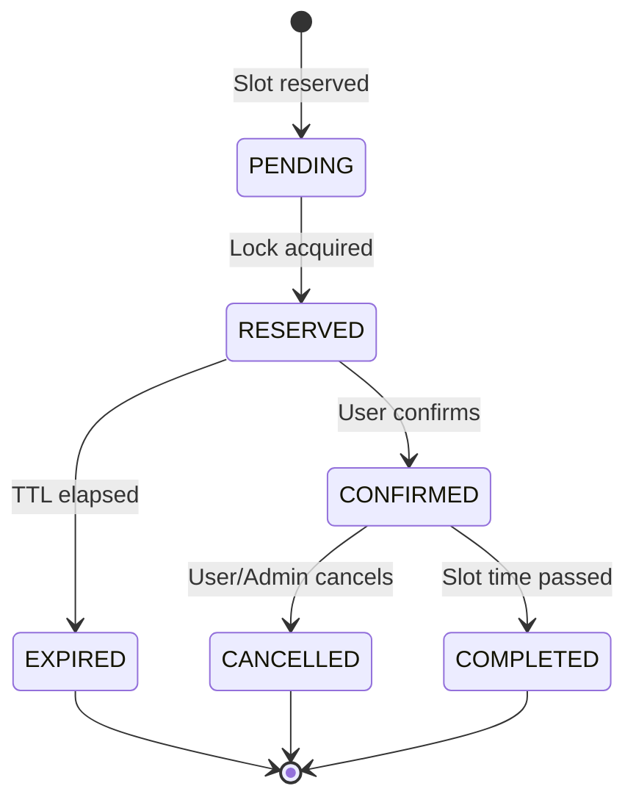

# Slot Booking Engine - Requirements Specification

## Overview
A distributed slot booking system with temporary reservations, queue management, and automatic expiration handling. Designed to prevent double bookings and handle high concurrency scenarios across multiple domains (appointments, reservations, resource allocation).

---

## 1. Functional Requirements

### 1.1 Slot Management

**Capabilities:**
- Admin can create, update, and delete slots
- Each slot must track availability and capacity

**Slot Properties:**
```typescript
{
  id: string
  startTime: DateTime
  endTime: DateTime
  capacity: number // Maximum concurrent bookings allowed
  currentBookings: number // Current active bookings
  status: SlotStatus
  metadata?: Record // Domain-specific data
}
```

**Slot Status:**
- `AVAILABLE` - Open for reservations
- `RESERVED` - Temporarily locked by user(s)
- `BOOKED` - Fully booked (capacity reached)
- `EXPIRED` - Past the endTime
- `BLOCKED` - Administratively blocked

**Business Rules:**
- Slots cannot overlap for the same resource
- Past slots are automatically marked as `EXPIRED`
- Capacity must be positive integer
- endTime must be after startTime

---

### 1.2 Slot Reservation (Temporary Lock)

**Flow:**
1. User requests to reserve a slot
2. System validates availability
3. Distributed lock acquired via Redis
4. Reservation held for configurable TTL (default: 2 minutes)
5. Lock prevents concurrent reservations for same slot

**Lock Mechanism:**
- **Technology:** Redis with SETNX/SET NX EX commands
- **Key Pattern:** `lock:slot:{slotId}:{userId}`
- **TTL:** Configurable (default: 120 seconds)
- **Auto-release:** Lock expires automatically if not confirmed

**Success Criteria:**
- User receives reservation confirmation with expiration time
- Slot status updates to `RESERVED` if first reservation
- Timer starts counting down

**Failure Scenarios:**
- Slot already fully booked → User added to queue
- Slot locked by another user → User added to queue
- Slot expired/blocked → Reject with error message

---

### 1.3 Booking Creation & Confirmation

**Initial Booking Creation:**
```typescript
{
  id: string
  userId: string
  slotId: string
  status: 'PENDING'
  reservedAt: DateTime
  expiresAt: DateTime
  confirmedAt?: DateTime
  completedAt?: DateTime
  cancelledAt?: DateTime
}
```

**Confirmation Process:**
1. User confirms booking within TTL window
2. System validates lock is still active
3. Booking status transitions: `PENDING` → `RESERVED` → `CONFIRMED`
4. Redis lock released
5. Slot capacity decremented
6. Confirmation notification sent

**Validation Checks:**
- Lock must still exist
- TTL not expired
- Slot still available
- User authenticated and authorized

---

### 1.4 Auto-Expiration Mechanism

**Background Worker (BullMQ):**
- Monitors bookings in `RESERVED` state
- Processes expiration when TTL elapses

**Expiration Flow:**
1. TTL countdown reaches zero
2. Worker detects expired reservation
3. Booking status → `EXPIRED`
4. Redis lock released (if still exists)
5. Slot capacity restored
6. Next queued user notified

**Worker Configuration:**
- **Queue Name:** `booking-expiration`
- **Concurrency:** Configurable (default: 5)
- **Retry Strategy:** Exponential backoff
- **Dead Letter Queue:** After 3 failed attempts

**Edge Cases:**
- Server restart during TTL → Jobs persisted in Redis
- Duplicate expiration attempts → Idempotency key prevents double processing
- Lock manually released → Worker handles gracefully

---

### 1.5 Queue System (FIFO)

**Queue Structure:**
```typescript
{
  id: string
  slotId: string
  userId: string
  position: number
  joinedAt: DateTime
  notifiedAt?: DateTime
  status: 'WAITING' | 'NOTIFIED' | 'EXPIRED' | 'CONVERTED'
}
```

**Queue Management:**
- **Technology:** Redis Sorted Set (ZADD with timestamp as score)
- **Key Pattern:** `queue:slot:{slotId}`
- **Ordering:** FIFO based on joinedAt timestamp

**Queue Processing:**
1. Slot becomes available (expiration/cancellation)
2. System retrieves first user from queue (ZPOPMIN)
3. Automatic reservation attempt for that user
4. User notified via configured channel (email/SMS/push)
5. User has limited time to claim reservation (configurable TTL)

**Queue Policies:**
- Maximum queue size per slot (configurable, default: 100)
- Queue timeout: User removed after X hours of inactivity
- Position updates broadcast in real-time (WebSocket/SSE)

**Anti-Gaming Measures:**
- One queue position per user per slot
- Rate limiting on queue join attempts
- Queue position cannot be transferred

---

### 1.6 Booking Cancellation

**User-Initiated Cancellation:**
- Allowed only for `CONFIRMED` bookings
- Must occur before slot startTime
- Immediate slot capacity restoration

**Cancellation Flow:**
1. User requests cancellation
2. Validate booking exists and is cancellable
3. Update booking status → `CANCELLED`
4. Restore slot capacity
5. Process next queued user automatically
6. Send cancellation confirmation

**Restrictions:**
- Cannot cancel after slot starts
- Cannot cancel `EXPIRED` or already `CANCELLED` bookings
- Cancellation may have time-based penalties (business logic)

**Admin Cancellation:**
- Can cancel any booking with reason
- Sends notification to affected user
- Optionally triggers refund workflow

---

### 1.7 Booking State Machine


**Valid Transitions:**
| From | To | Trigger |
|------|-----|---------|
| PENDING | RESERVED | Lock acquired successfully |
| RESERVED | CONFIRMED | User confirms within TTL |
| RESERVED | EXPIRED | TTL elapses without confirmation |
| CONFIRMED | CANCELLED | User/Admin cancellation |
| CONFIRMED | COMPLETED | Slot endTime passed |

**Invalid Transitions (Must Reject):**
- `EXPIRED` → `CONFIRMED`
- `CANCELLED` → `CONFIRMED`
- `COMPLETED` → any state
- `CONFIRMED` → `PENDING`

**State Transition Guards:**
- Database transaction ensures atomicity
- Optimistic locking prevents race conditions
- Audit log records all transitions with timestamp and actor

---

### 1.8 Idempotent Reservations

**Idempotency Key:**
- Generated client-side or server-side
- Pattern: `{userId}:{slotId}:{timestamp}`
- Stored in Redis with TTL matching reservation window

**Duplicate Detection:**
1. Check for existing active reservation
2. Check for existing queue position
3. Return existing reservation if found
4. Create new only if none exists

**Implementation:**
```typescript
// Redis check
const existingLock = await redis.get(`lock:slot:{slotId}:{userId}`);
const existingQueue = await redis.zscore(`queue:slot:{slotId}`, userId);

if (existingLock || existingQueue) {
  return existingReservation; // Idempotent response
}
```

**HTTP Status Codes:**
- `200 OK` - Existing reservation returned
- `201 Created` - New reservation created
- `409 Conflict` - Invalid duplicate attempt detected

---

### 1.9 Queue Position Visibility

**User Information:**
```typescript
{
  position: number // Current position in queue
  totalInQueue: number // Total waiting users
  estimatedWaitTime: string // Calculated estimate
  slotId: string
  joinedAt: DateTime
}
```

**Real-Time Updates:**
- WebSocket connection for position changes
- Server-Sent Events (SSE) alternative
- Polling endpoint for fallback

**API Endpoint:**
```
GET /api/slots/{slotId}/queue/position
Authorization: Bearer {token}

Response:
{
  "position": 3,
  "totalInQueue": 15,
  "estimatedWaitTime": "~6 minutes",
  "slotDetails": {...}
}
```

---

### 1.10 Logging & Audit Trail

**Required Log Events:**
1. **Reservation Attempts**
   - Timestamp, userId, slotId, outcome (success/failure/queued)
   
2. **Lock Lifecycle**
   - Lock acquisition, TTL extension, expiration, manual release
   
3. **State Transitions**
   - From state, to state, trigger, actor, timestamp
   
4. **Expiration Events**
   - Booking ID, slot ID, expiration reason, next action

5. **Queue Operations**
   - Join, leave, position change, notification sent

6. **Cancellations**
   - Cancellation reason, refund status, who initiated

**Log Structure:**
```typescript
{
  eventType: string
  timestamp: DateTime
  userId?: string
  slotId?: string
  bookingId?: string
  action: string
  metadata: Record
  ipAddress?: string
  userAgent?: string
}
```

**Storage:**
- Structured logging (JSON format)
- Centralized logging system (ELK, Datadog, CloudWatch)
- Retention: 90 days minimum for audit compliance

---

## 2. Non-Functional Requirements

### 2.1 Concurrency Safety

**Requirements:**
- Zero double bookings under concurrent load
- Distributed lock mechanism prevents race conditions
- Database-level constraints as secondary safety net

**Implementation Strategies:**
- Redis distributed locks (primary)
- Database unique constraints on (userId, slotId) for active bookings
- Optimistic locking with version numbers
- Transaction isolation level: READ COMMITTED minimum

**Testing:**
- Concurrent reservation load tests (100+ simultaneous requests)
- Chaos engineering: network partitions, Redis failures
- Race condition simulation tests

---

### 2.2 Performance

**Response Time SLAs:**
| Operation | Target | Maximum |
|-----------|--------|---------|
| Slot reservation | <200ms | 500ms |
| Queue join | <100ms | 300ms |
| Booking confirmation | <300ms | 1s |
| Queue position query | <50ms | 150ms |
| Cancellation | <200ms | 500ms |

**Throughput:**
- Handle 1000 concurrent reservation requests
- Process 100 queue updates per second
- Support 10,000 active WebSocket connections

**Optimization Strategies:**
- Redis for fast lock operations
- Database connection pooling
- Indexed queries on slotId, userId, status
- Caching of slot availability status

---

### 2.3 Scalability

**Horizontal Scaling:**
- Stateless NestJS instances behind load balancer
- Redis Cluster for distributed lock coordination
- Database read replicas for query scaling
- BullMQ workers can scale independently

**Resource Requirements:**
| Component | Min | Recommended |
|-----------|-----|-------------|
| NestJS instances | 2 | 3+ |
| Redis nodes | 1 (with persistence) | 3 (cluster) |
| Database | 1 primary | 1 primary + 2 replicas |
| BullMQ workers | 2 | 5+ |

**Load Distribution:**
- Round-robin load balancing for API instances
- Redis Cluster for automatic sharding
- Database connection pooling per instance

---

### 2.4 Reliability

**Failure Recovery:**
- **Server Restart:** BullMQ jobs persisted in Redis, resume automatically
- **Redis Failure:** Graceful degradation, reject new reservations, preserve existing
- **Database Failure:** Queue operations in Redis, sync on recovery

**Data Durability:**
- Redis persistence enabled (AOF + RDB)
- Database backups every 6 hours
- Transaction logs for point-in-time recovery

**Lock Safety:**
- Locks never permanent (always have TTL)
- Orphaned lock cleanup job runs every 5 minutes
- Dead letter queue for failed expiration jobs

**Health Checks:**
```
GET /health
{
  "status": "healthy",
  "components": {
    "database": "up",
    "redis": "up",
    "queue": "up"
  }
}
```

---

### 2.5 Data Consistency

**Consistency Guarantees:**
- Redis lock state and DB booking state synchronized
- Two-phase commit for critical operations
- Eventual consistency acceptable for queue positions

**Synchronization Points:**
1. Lock acquired → DB booking created (transaction)
2. Lock expired → DB booking updated (idempotent)
3. Confirmation → Lock released + DB updated (atomic)

**Conflict Resolution:**
- Database is source of truth for booking status
- Redis TTL auto-corrects stale locks
- Reconciliation job runs hourly to detect inconsistencies

**Validation:**
```sql
-- Ensure no booking exists without corresponding slot
-- Ensure no RESERVED booking without Redis lock
-- Ensure slot capacity never exceeded
```

---

### 2.6 Fault Tolerance

**Graceful Degradation:**
| Failure | System Behavior |
|---------|-----------------|
| Redis unavailable | Reject new reservations, preserve confirmed bookings |
| Database read failure | Serve cached data, log errors |
| Database write failure | Reject confirmations, keep reservations in Redis |
| Queue worker down | Accumulate jobs, process on recovery |

**Circuit Breaker Pattern:**
- Redis operations wrapped in circuit breaker
- Auto-retry with exponential backoff
- Fallback to synchronous expiration if queue fails

**Error Responses:**
```json
{
  "error": "ServiceUnavailable",
  "message": "Reservation system temporarily unavailable",
  "retryAfter": 30,
  "supportContact": "support@example.com"
}
```

---

### 2.7 Security

**Authentication:**
- JWT-based authentication required for all booking operations
- Token validation on every request
- Refresh token rotation

**Authorization:**
- Users can only reserve/cancel their own bookings
- Admin role for slot management
- Service accounts for system operations

**Rate Limiting:**
| Endpoint | Limit | Window |
|----------|-------|--------|
| Reserve slot | 10 requests | 1 minute |
| Join queue | 20 requests | 1 minute |
| Check position | 100 requests | 1 minute |
| Cancel booking | 5 requests | 1 minute |

**Data Protection:**
- PII encrypted at rest
- Audit logs exclude sensitive data
- GDPR-compliant data retention

**API Security:**
- CORS configured for allowed origins
- Input validation and sanitization
- SQL injection prevention (parameterized queries)
- XSS protection headers

---

### 2.8 Maintainability

**Modular Architecture:**
```
src/
├── modules/
│   ├── slot/
│   │   ├── slot.controller.ts
│   │   ├── slot.service.ts
│   │   ├── slot.repository.ts
│   │   └── dto/
│   ├── booking/
│   │   ├── booking.controller.ts
│   │   ├── booking.service.ts
│   │   ├── booking.repository.ts
│   │   └── state-machine/
│   ├── queue/
│   │   ├── queue.service.ts
│   │   ├── queue.processor.ts
│   │   └── queue.repository.ts
│   ├── lock/
│   │   ├── lock.service.ts
│   │   └── distributed-lock.ts
│   └── worker/
│       ├── expiration.processor.ts
│       └── reconciliation.processor.ts
├── common/
│   ├── guards/
│   ├── interceptors/
│   └── decorators/
└── config/
```

**Code Quality:**
- TypeScript strict mode enabled
- ESLint + Prettier configured
- Pre-commit hooks (Husky)
- Minimum 80% test coverage

**Documentation:**
- OpenAPI/Swagger spec for all endpoints
- Inline code comments for complex logic
- Architecture decision records (ADRs)
- Deployment runbooks

---

### 2.9 Observability

**Logging:**
- Structured JSON logs (Winston/Pino)
- Log levels: ERROR, WARN, INFO, DEBUG
- Correlation IDs for request tracing
- Sensitive data masking

**Metrics:**
```
# Business Metrics
booking_reservations_total{status="success|failure"}
booking_confirmations_total
booking_expirations_total
queue_length{slot_id}
average_wait_time_seconds

# Technical Metrics
http_request_duration_seconds{endpoint,method,status}
redis_operation_duration_seconds{operation}
database_query_duration_seconds{query_type}
```

**Tracing:**
- Distributed tracing (OpenTelemetry)
- Trace reservation flow across services
- Identify slow database queries
- Redis operation spans

**Alerting:**
- High error rate (>5% in 5 minutes)
- Locks exceeding TTL threshold
- Queue length exceeding capacity
- Database connection pool exhaustion

**Dashboards:**
- Real-time booking metrics
- Queue statistics per slot
- System health overview
- Error rate trends

---

### 2.10 Extensibility

**Domain Agnostic Design:**
The core booking engine supports multiple domains through configuration:

**Configuration Schema:**
```typescript
interface DomainConfig {
  domainType: 'appointment' | 'seat' | 'resource' | 'service'
  entityName: string // "Doctor", "Table", "Technician"
  slotDuration: number // minutes
  advanceBookingDays: number
  cancellationPolicy: {
    allowedUntil: number // hours before start
    refundPercentage: number
  }
  queueSettings: {
    enabled: boolean
    maxSize: number
    notificationChannels: string[]
  }
  customFields: Record
}
```

**Example Configurations:**

**Medical Appointments:**
```json
{
  "domainType": "appointment",
  "entityName": "Doctor",
  "slotDuration": 30,
  "advanceBookingDays": 60,
  "cancellationPolicy": {
    "allowedUntil": 24,
    "refundPercentage": 100
  }
}
```

**Restaurant Tables:**
```json
{
  "domainType": "seat",
  "entityName": "Table",
  "slotDuration": 120,
  "advanceBookingDays": 14,
  "queueSettings": {
    "enabled": true,
    "maxSize": 50
  }
}
```

**Extension Points:**
- Custom validation hooks
- Domain-specific notification templates
- Configurable business rules
- Plugin architecture for integrations

---

## 3. Technical Stack

**Backend:**
- **Framework:** NestJS (Node.js)
- **Language:** TypeScript
- **Database:** PostgreSQL 14+ (or MySQL 8+)
- **Cache/Locks:** Redis 7+
- **Queue:** BullMQ
- **ORM:** TypeORM or Prisma

**Infrastructure:**
- **Container:** Docker
- **Orchestration:** Kubernetes (optional)
- **Load Balancer:** nginx or AWS ALB
- **Monitoring:** Prometheus + Grafana
- **Logging:** ELK Stack or CloudWatch

---

## 4. API Endpoints

### Slot Management
```
POST   /api/admin/slots              Create slot
GET    /api/slots                     List available slots
GET    /api/slots/:id                 Get slot details
PUT    /api/admin/slots/:id           Update slot
DELETE /api/admin/slots/:id           Delete slot
```

### Booking Operations
```
POST   /api/bookings/reserve          Reserve slot (acquire lock)
POST   /api/bookings/:id/confirm      Confirm reservation
POST   /api/bookings/:id/cancel       Cancel booking
GET    /api/bookings/my               Get user's bookings
GET    /api/bookings/:id              Get booking details
```

### Queue Operations
```
POST   /api/slots/:id/queue           Join queue
DELETE /api/slots/:id/queue           Leave queue
GET    /api/slots/:id/queue/position  Get queue position
```

### Real-Time
```
WS     /ws/bookings                   Booking updates
WS     /ws/queue/:slotId              Queue position updates
```

---

## 5. Testing Strategy

**Unit Tests:**
- Service layer logic
- State machine transitions
- Lock acquisition/release
- Queue operations

**Integration Tests:**
- API endpoint flows
- Database transactions
- Redis operations
- BullMQ job processing

**End-to-End Tests:**
- Complete booking flow
- Concurrent reservation scenarios
- Expiration handling
- Queue processing

**Performance Tests:**
- Load testing (JMeter/k6)
- Concurrent user simulation
- Redis performance under load
- Database query optimization

**Chaos Tests:**
- Redis failure scenarios
- Database connection loss
- Worker process crashes
- Network partitions

---

## 6. Deployment Checklist

- [ ] Environment variables configured
- [ ] Database migrations applied
- [ ] Redis cluster configured with persistence
- [ ] BullMQ workers deployed and monitored
- [ ] Load balancer health checks configured
- [ ] Monitoring dashboards created
- [ ] Alerting rules configured
- [ ] Rate limiting enabled
- [ ] Backup strategy verified
- [ ] Rollback plan documented
- [ ] Security scan completed
- [ ] Performance baseline established

---

## 7. Future Enhancements

**Phase 2:**
- Recurring slot patterns
- Multi-slot bookings (packages)
- Waitlist with priority tiers
- Dynamic pricing based on demand

**Phase 3:**
- Mobile app integration
- Calendar sync (Google/Outlook)
- SMS/Email notification service
- Analytics dashboard

**Phase 4:**
- Machine learning for demand prediction
- Automated slot optimization
- Multi-tenant support
- GraphQL API option

---

## Document Control

| Version | Date | Author | Changes |
|---------|------|--------|---------|
| 1.0 | 2024-02-10 | System Architect | Initial comprehensive specification |

**Review Cycle:** Quarterly or upon major feature additions

**Approval Required:** Engineering Lead, Product Owner, Security Team